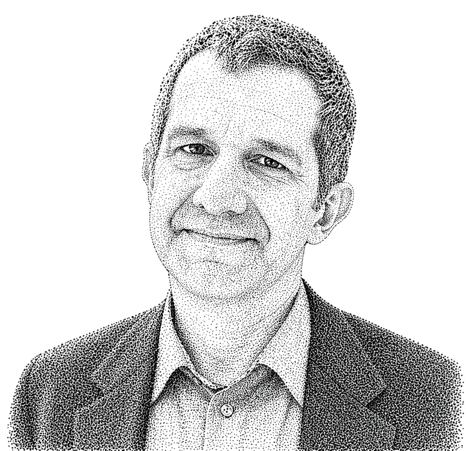
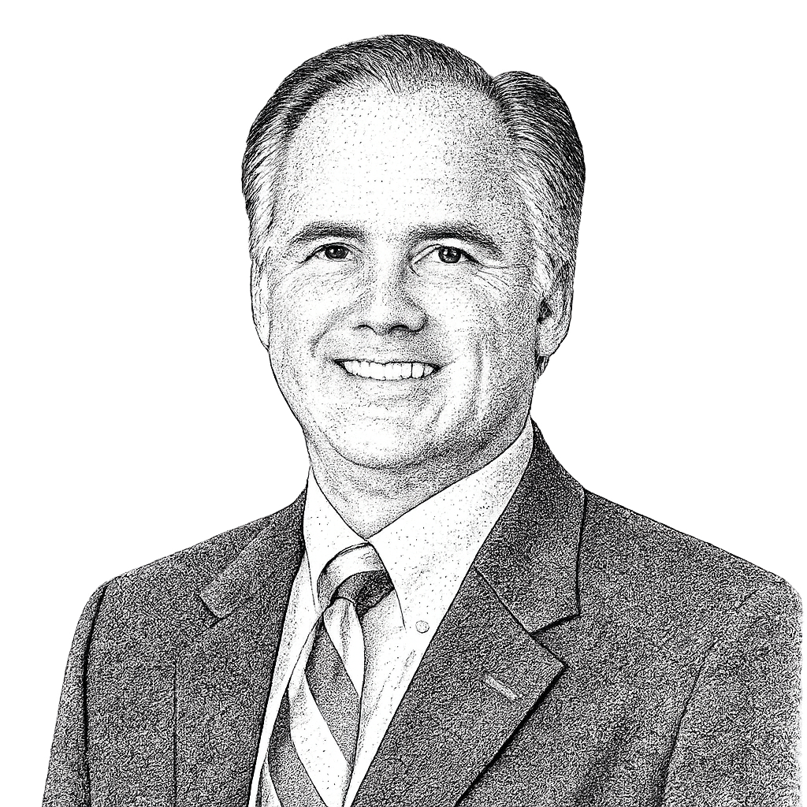

## What We Do

The Superpowers Project is a coalition of educators, schools, and organizations working to make the assessment of durable human skills practical at scale. We use AI as a first reader of authentic student work — drafts, projects, portfolios — surfacing evidence and patterns that teachers then validate, contextualize, and act on. Our goal is not to automate teaching but to give it back to teachers: to free them from the labor that has crowded out mentoring, to enable real iteration in student work, and ultimately to make student capability legible to colleges and employers directly. Everything we learn, we share.

## Who We Are

More than any individual, the Superpowers Project consists of its [member organizations](/members) and the individuals who contribute their time and enthusiasm.  The founders of this project, David Rea and Scott Looney, are merely the connectors and collaters of the combined wisdom and experience of this extraordinary group. 

### David Rea

David Rea brings a rare combination of education and technology experience to the Superpowers Project, having most recently served as Director of Customer Solutions at ETS, where he worked following ETS's acquisition of the Mastery Transcript Consortium, where he was CTO. Earlier in his career David was a Visiting Scholar in Connected Learning and taught computer science and physics at both Phillips Academy Andover and Phillips Exeter Academy, and prior to education he served as Director of Technology Assessment at General Atlantic. He has also been a founder, investor, employee, and advisor at a range of technology startups.

### Scott Looney

Scott Looney is the founder of the Mastery Transcript and Head of School at Hawken School in Cleveland, where he launched the Mastery School of Hawken — an alternative high school organized around real-world problem solving that uses only the Mastery Transcript in place of traditional grades. A veteran educator whose career spans Cranbrook, Lake Forest Academy, Phillips Academy, and DePauw University, Scott serves as Board Chair of the Mastery Transcript Consortium and sits on the boards of NAIS, Global Online Academy, the Kent State Innovation Advisory, K-12 Change Lab, University Circle, OAIS, and Midwest Boarding Schools.
